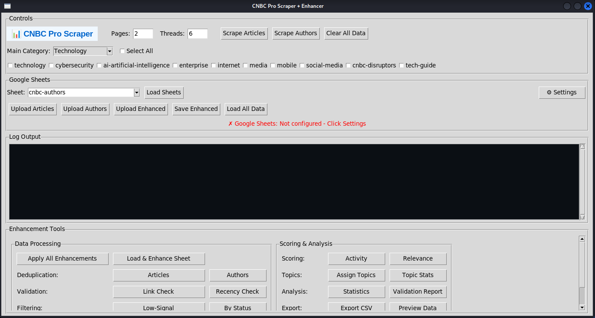
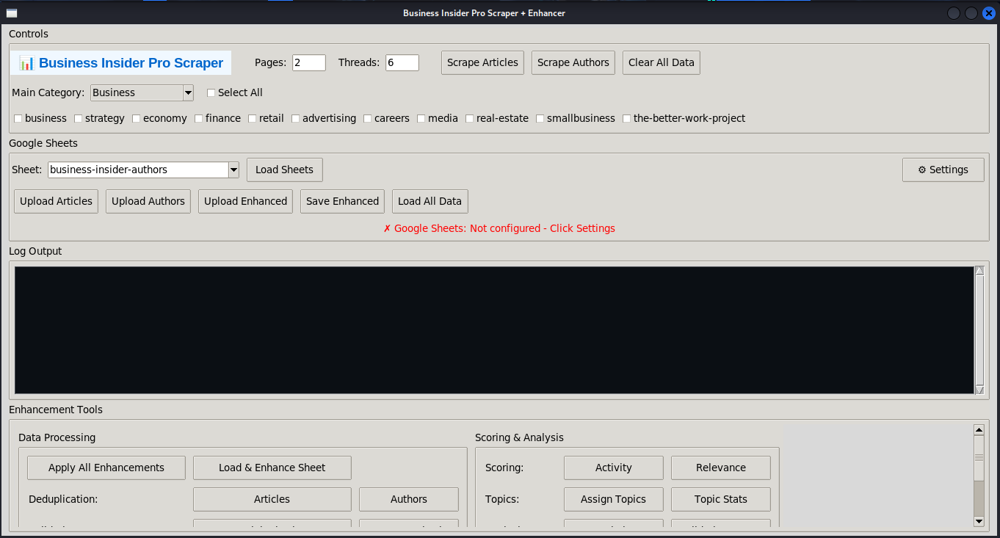
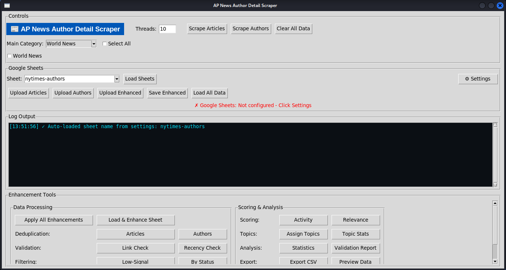
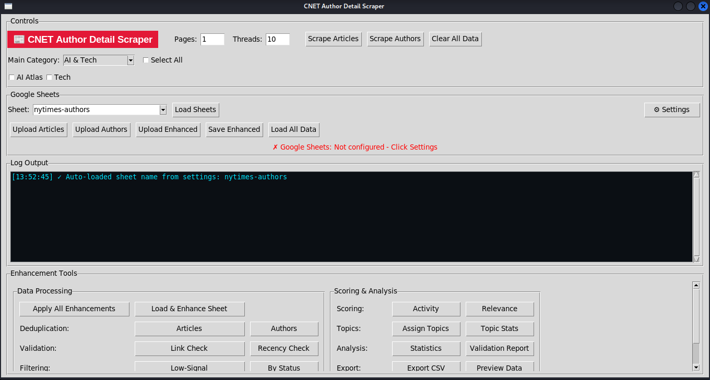
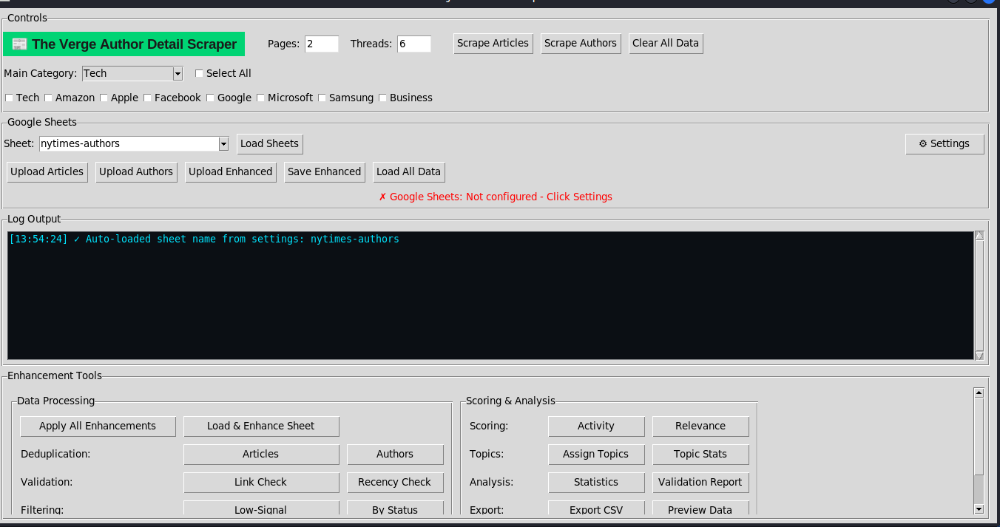
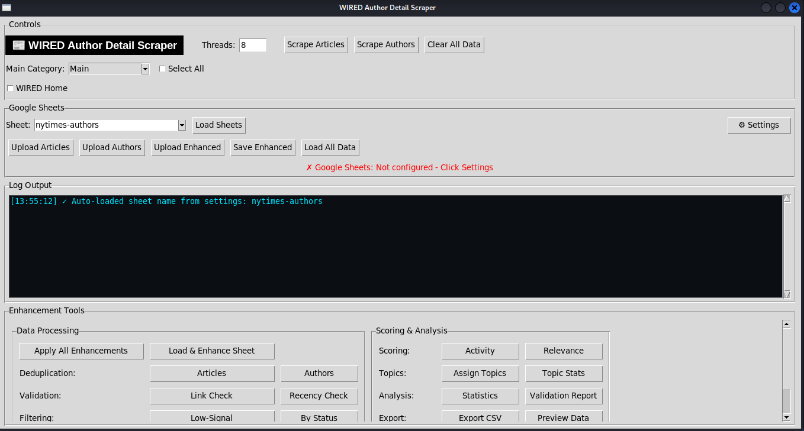

<div align="center">


<br/><br/>

# 🗞️ Media Intelligence & Outreach Suite

### *Six fully-featured desktop applications that automate article scraping, author discovery, data enrichment, and personalised email outreach — across the world's top tech & news publications.*

<br/>

</div>

---

## 📌 Table of Contents

- [Overview](#-overview)
- [Projects](#-projects)
- [Screenshots](#-screenshots)
- [Features](#-features)
- [Architecture](#-architecture)
- [Tech Stack](#-tech-stack)
- [Getting Started](#-getting-started)
- [Configuration](#-configuration)
- [How It Works](#-how-it-works)
- [Project Structure](#-project-structure)

---

## 🧭 Overview

The **Media Intelligence & Outreach Suite** is a portfolio of six independent Python desktop tools, each purpose-built to scrape a specific major media publication. Every tool follows the same battle-tested architecture: a **scraping engine** that collects articles and author profiles, an **enhancement pipeline** that cleans, deduplicates, and scores that data, a **Google Sheets sync** layer for persistence, and an **email outreach module** for contacting authors directly — all wrapped in a polished **Tkinter GUI** with live progress logging.

This suite was designed for media intelligence professionals, PR teams, and journalists who need reliable, automated access to editorial contacts at scale.

---

## 📁 Projects

| # | Folder | Publication | Focus Area |
|---|--------|-------------|------------|
| 1 | `cnbc/` | **CNBC** | Finance, Markets, Tech, Business |
| 2 | `business_insider/` | **Business Insider** | Business, Strategy, Economy, Startups |
| 3 | `ApNews/` | **AP News** | Breaking News, Politics, World |
| 4 | `cnet/` | **CNET** | Consumer Tech, Reviews, Science |
| 5 | `venture/` | **The Verge** | Technology, Culture, Science |
| 6 | `wired/` | **Wired** | Future Tech, AI, Innovation |

---

## 🖼️ Screenshots

<table>
  <tr>
    <td align="center">
      <strong>CNBC Scraper</strong><br/>
      
    </td>
    <td align="center">
      <strong>Business Insider Scraper</strong><br/>
      
    </td>
  </tr>
  <tr>
    <td align="center">
      <strong>AP News Scraper</strong><br/>
      
    </td>
    <td align="center">
      <strong>CNET Scraper</strong><br/>
      
    </td>
  </tr>
  <tr>
    <td align="center">
      <strong>The Verge Scraper</strong><br/>
      
    </td>
    <td align="center">
      <strong>Wired Scraper</strong><br/>
      
    </td>
  </tr>
</table>

---

## ✨ Features

### 🔍 Article Scraping Engine
- Paginated crawling across multiple publication categories simultaneously
- Custom CSS selector maps per publication (adapted to each site's DOM structure)
- In-memory article caching to avoid re-fetching already-seen pages
- Configurable page depth limits and request delays to respect server load
- Twitter/social handle extraction embedded in article metadata (CNBC)

### 👤 Author Profile Extraction
- Full author name, biography, role, and profile URL
- Email extraction including **Cloudflare-obfuscated email decoding** (hex XOR decoder)
- Social profile links (Twitter/X, LinkedIn) scraped from author pages
- Total article count per author tracked and stored

### 🔄 Data Enhancement Pipeline
- URL-based deduplication — removes exact-duplicate articles and author records
- Smart author merging — if the same author appears multiple times, records are merged and the best available email/bio is retained
- Email format validation via regex before storage
- Author scoring system to rank contacts by relevance and data completeness

### 📊 Google Sheets Integration
- OAuth2 Service Account authentication via `gspread`
- Automatically creates or opens existing spreadsheets by name
- Writes articles and authors to separate named worksheets with typed headers
- Incremental upload — only pushes new rows, preserving existing data

### 📧 Email Outreach Module
- Load author lists directly from Google Sheets
- Compose personalised emails using dynamic template variables (`{{author_name}}`, `{{publication}}`, etc.)
- Live email preview before sending
- SMTP send with configurable host, port, and credentials
- Sent-email tracking and campaign logging per session

### 🖥️ Desktop GUI (Tkinter)
- Themed, publication-branded interface per tool (colours, fonts, icons)
- Real-time scrollable log panel with colour-coded log levels (`info`, `progress`, `error`)
- Multi-tab layout separating Articles, Authors, Enhancement, and Outreach
- Settings dialog for Google credentials and SMTP configuration
- Business Insider includes a unified **platform launcher** with card-based tool selection

### ⚡ Performance
- `ThreadPoolExecutor` for concurrent HTTP requests across categories
- Persistent `requests.Session` with optimised headers to reduce handshake overhead
- Smart rate limiting with randomised delays to avoid detection and bans

---

## 🏗️ Architecture

```
┌─────────────────────────────────────────────────────────────┐
│                    Desktop GUI (Tkinter)                     │
│         scraper_ui.py  │  outreach_ui.py  │  settings       │
└───────────────┬─────────────────┬───────────────────────────┘
                │                 │
    ┌───────────▼──────┐  ┌───────▼────────┐
    │  Scraping Engine │  │ Outreach Engine │
    │  scraper_core.py │  │  email_core.py  │
    └───────────┬──────┘  └───────┬────────┘
                │                 │
    ┌───────────▼──────────────────▼────────┐
    │         Data Enhancement Layer         │
    │           enhancer_core.py             │
    │  (dedup · merge · score · validate)    │
    └───────────────────┬────────────────────┘
                        │
    ┌───────────────────▼────────────────────┐
    │          Persistence Layer              │
    │  sheets_manager.py  ←→  Google Sheets  │
    │  config_manager.py  ←→  JSON configs   │
    └─────────────────────────────────────────┘
```

---

## 🛠️ Tech Stack

<table>
  <thead>
    <tr>
      <th>Layer</th>
      <th>Technology</th>
      <th>Purpose</th>
    </tr>
  </thead>
  <tbody>
    <tr>
      <td><strong>Language</strong></td>
      <td>
        
      </td>
      <td>Core runtime</td>
    </tr>
    <tr>
      <td><strong>GUI Framework</strong></td>
      <td>
        
      </td>
      <td>Cross-platform desktop interface with themed widgets</td>
    </tr>
    <tr>
      <td><strong>HTTP Client</strong></td>
      <td>
        
      </td>
      <td>Session-pooled HTTP requests with browser-spoofed headers</td>
    </tr>
    <tr>
      <td><strong>HTML Parsing</strong></td>
      <td>
        
      </td>
      <td>DOM traversal and CSS selector-based data extraction</td>
    </tr>
    <tr>
      <td><strong>Data Processing</strong></td>
      <td>
        
      </td>
      <td>Tabular data manipulation, deduplication, and export</td>
    </tr>
    <tr>
      <td><strong>Concurrency</strong></td>
      <td>
        
      </td>
      <td>Multi-threaded scraping across categories simultaneously</td>
    </tr>
    <tr>
      <td><strong>Cloud Storage</strong></td>
      <td>
        
      </td>
      <td>Persistent cloud storage for articles and author data</td>
    </tr>
    <tr>
      <td><strong>Authentication</strong></td>
      <td>
        
      </td>
      <td>Google API authentication via service account credentials</td>
    </tr>
    <tr>
      <td><strong>Email</strong></td>
      <td>
        
      </td>
      <td>Personalised email delivery with template variable substitution</td>
    </tr>
  </tbody>
</table>

---

## 🚀 Getting Started

### Prerequisites

- Python **3.11** or higher
- A **Google Cloud Service Account** with Google Sheets & Drive API enabled
- An **SMTP-enabled email account** for the outreach module

### 1 — Clone the Repository

```bash
git clone https://github.com/<your-username>/media-scraper-suite.git
cd media-scraper-suite
```

### 2 — Install Dependencies

Each publication has its own `requirements.txt`. Navigate into the folder you want to use:

```bash
cd cnbc                        # or: business_insider / ApNews / cnet / venture / wired
pip install -r requirements.txt
```

**Common dependencies across all projects:**

```
pandas
beautifulsoup4
requests
gspread
oauth2client
google-api-python-client
```

### 3 — Configure Google Credentials

1. Go to [Google Cloud Console](https://console.cloud.google.com/)
2. Create a Service Account and download the JSON key
3. Place it at:

```
<publication>/data/google_credentials.json
```

4. Share your target Google Sheet with the service account email.

### 4 — Configure SMTP (for Outreach)

Edit `data/outreach_config.json`:

```json
{
  "smtp_host": "smtp.gmail.com",
  "smtp_port": 587,
  "sender_email": "you@yourdomain.com",
  "sender_password": "your-app-password",
  "email_templates": [
    {
      "name": "Default Outreach",
      "subject": "Collaboration Opportunity — {{author_name}}",
      "body": "Hi {{author_name}},\n\nI've been following your work at {{publication}}..."
    }
  ]
}
```

### 5 — Launch the Application

```bash
python main.py
```

The desktop GUI will open. From there you can configure categories, start scraping, enhance the data, sync to Google Sheets, and launch the outreach tool.

---

## ⚙️ Configuration

### `data/scraper_config.json`

Controls which categories to scrape, how many pages deep to go, and threading settings.

```json
{
  "site_name": "CNBC",
  "base_url": "https://www.cnbc.com",
  "categories": {
    "Technology": "https://www.cnbc.com/technology/",
    "Finance":    "https://www.cnbc.com/finance/",
    "Markets":    "https://www.cnbc.com/markets/"
  },
  "max_pages_per_category": 5,
  "default_threads": 6,
  "request_timeout": 20
}
```

| Field | Description |
|---|---|
| `categories` | Key–value map of category name → URL to scrape |
| `max_pages_per_category` | How many paginated pages to crawl per category |
| `default_threads` | Number of concurrent threads for fetching |
| `request_timeout` | HTTP timeout in seconds per request |

---

## 🔬 How It Works

```
1. USER selects categories and page depth in the GUI
       │
2. scraper_core.py spawns a ThreadPoolExecutor
   └─ Fetches each category URL across N pages concurrently
   └─ Parses HTML with BeautifulSoup using publication-specific CSS selectors
   └─ Extracts: Title · URL · Date · Author name · Author profile URL
       │
3. For each author profile URL found:
   └─ Fetches the author page
   └─ Extracts: Email (incl. Cloudflare-encoded) · Bio · Role · Social links
   └─ Results cached in-memory to avoid re-fetching
       │
4. enhancer_core.py runs the enhancement pipeline:
   └─ Deduplicates articles by URL
   └─ Deduplicates authors by profile URL, merging best available data
   └─ Validates and cleans all email addresses via regex
   └─ Scores each author record by data completeness
       │
5. sheets_manager.py uploads results to Google Sheets:
   └─ Opens or creates the target spreadsheet
   └─ Writes articles to "Articles" worksheet
   └─ Writes authors to "Authors" worksheet
       │
6. outreach_ui.py loads author data from Sheets:
   └─ User selects authors and an email template
   └─ Template variables resolved per author (name, publication, etc.)
   └─ Email previewed, then sent via SMTP
   └─ Sent emails logged to campaign history
```

---

## 📂 Project Structure

Every publication folder follows the same modular layout:

```
<publication>/
│
├── main.py                     # Entry point — launches the Tkinter GUI
├── requirements.txt            # Python package dependencies
│
├── modules/
│   ├── __init__.py
│   ├── scraper_core.py         # Core scraping logic (publication-specific selectors)
│   ├── enhancer_core.py        # Deduplication, merging, email validation, scoring
│   ├── config_manager.py       # Loads JSON configs, manages runtime settings
│   ├── sheets_manager.py       # Google Sheets read/write via gspread
│   └── email_core.py           # SMTP email composition and delivery (TechCrunch/BI)
│
├── ui/
│   ├── __init__.py
│   ├── scraper_ui.py           # Main scraper window with live log panel
│   ├── outreach_ui.py          # Author outreach and email campaign window
│   └── settings_dialog.py     # Credentials and SMTP settings dialog
│
└── data/
    ├── scraper_config.json     # Categories, URLs, pagination, thread settings
    └── outreach_config.json    # SMTP config and email templates
```

> **`business_insider/`** additionally includes a **unified platform launcher** (`main.py`) with a card-based menu that lets you choose between the Scraper and Outreach tools from a single branded home screen, and a `settings_dialog.py` for managing credentials without editing JSON directly.

---

## 🔐 Security Notes

- `data/google_credentials.json` is **not committed** to this repository. You must supply your own Google Service Account key.
- Never hard-code SMTP passwords in source files — use `outreach_config.json` (which is gitignored in production) or environment variables.
- Add the following to your `.gitignore` before pushing:

```gitignore
data/google_credentials.json
data/outreach_config.json
__pycache__/
*.pyc
logs/
```

---

## ⚠️ Disclaimer

These tools are built for **legitimate research, journalistic, and PR outreach purposes**. Always review and respect each publication's `robots.txt` and Terms of Service before running large-scale scrapes. Responsible, low-frequency usage with appropriate delays is enforced by design within the scraping engine.

---

<div align="center">

**Built with Python · Tkinter · BeautifulSoup · Google Sheets API**

*If you found this useful, consider starring the repository ⭐*

</div>
